# 📊 E-commerce Sales SQL Analysis

## Overview
This project analyzes the **Kaggle Sample Sales Dataset** using SQL.  
It explores sales trends by year, quarter, month, customers, products, regions, and deal sizes.  
The repo includes SQL scripts and screenshots of results.

---

## Dataset
- Source: [Kaggle Sample Sales Data](https://www.kaggle.com/datasets/kyanyoga/sample-sales-data)  
- Table: `sales_data`  
- ## Dataset Details
The dataset contains sales transactions with the following fields:

| Column Name       | Description |
|-------------------|-------------|
| ORDERNUMBER       | Unique identifier for each order |
| QUANTITYORDERED   | Quantity of items in the order line |
| PRICEEACH         | Price per individual item |
| ORDERLINENUMBER   | Line number of the order (for multi-item orders) |
| SALES             | Total sales amount for that line (QUANTITYORDERED × PRICEEACH) |
| ORDERDATE         | Date of the order |
| STATUS            | Status of order (e.g., Shipped, Cancelled) |
| QTR_ID            | Quarter of the year (1–4) |
| MONTH_ID          | Month of the year (1–12) |
| YEAR_ID           | Year of the order |
| PRODUCTLINE       | Product category (e.g., Classic Cars, Motorcycles) |
| MSRP              | Manufacturer’s Suggested Retail Price |
| PRODUCTCODE       | Unique product code |
| CUSTOMERNAME      | Customer’s full name |
| PHONE             | Customer phone number |
| ADDRESSLINE1      | Customer address (line 1) |
| ADDRESSLINE2      | Customer address (line 2, optional) |
| CITY              | Customer city |
| STATE             | Customer state/province |
| POSTALCODE        | Customer postal/zip code |
| COUNTRY           | Customer country |
| TERRITORY         | Sales territory (e.g., NA, EMEA) |
| CONTACTLASTNAME   | Contact person’s last name |
| CONTACTFIRSTNAME  | Contact person’s first name |
| DEALSIZE          | Size of the deal (e.g., Small, Medium, Large) |  


🛠️ Tools & Technologies

Database: MySQL 

SQL Features Used:

SELECT, WHERE, ORDER BY, GROUP BY

JOIN (INNER, LEFT, RIGHT)

Subqueries

Aggregate functions (SUM, AVG, COUNT, MAX, MIN)

Views

Index optimization

## Project Structure
ecommerce_sales_sql_analysis/
│

├── sql/

│ ├── 01_create_table.sql

│ ├── 02_load_data.sql

│ ├── 03_sanity_checks.sql

│ └── 04_final_analysis.sql

│

├── screenshots

│ ├── 01_total_rows.png

│ ├── 02_total_revenue.png

│ ├── 03_distinct_counts.png

│ └── ...

│

├── .gitignore

└── README.md

## SQL Workflow
1. **Create Table** → schema (`01_create_table.sql`)  
2. **Load Data** → import CSV (`02_load_data.sql`)  
3. **Sanity Checks** → verify data (`03_sanity_checks.sql`)  
4. **Final Analysis** → queries for business insights (`04_final_analysis.sql`)  

---

## Questions & Screenshots

### 1. Basic Overview
- ❓ How many rows of data are in the table?  
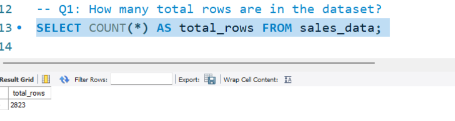  

- ❓ What is the total revenue?  
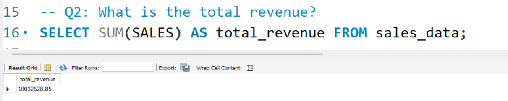  

- ❓ How many distinct customers, products, and countries?  
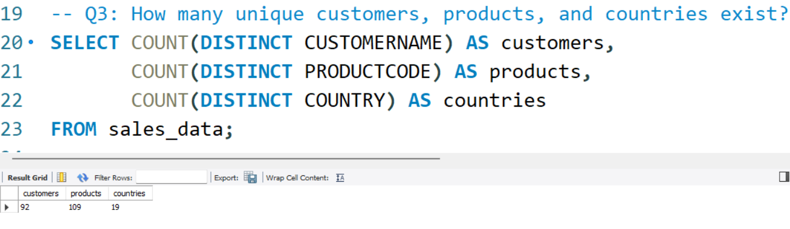  

---

### 2. Time-Based Analysis
- ❓ What are total sales by year?  
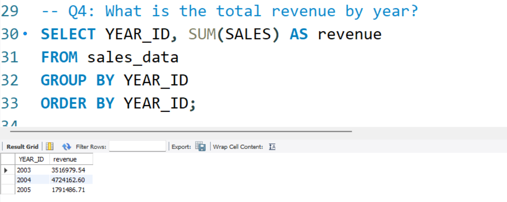  

- ❓ What are total sales by quarter?  
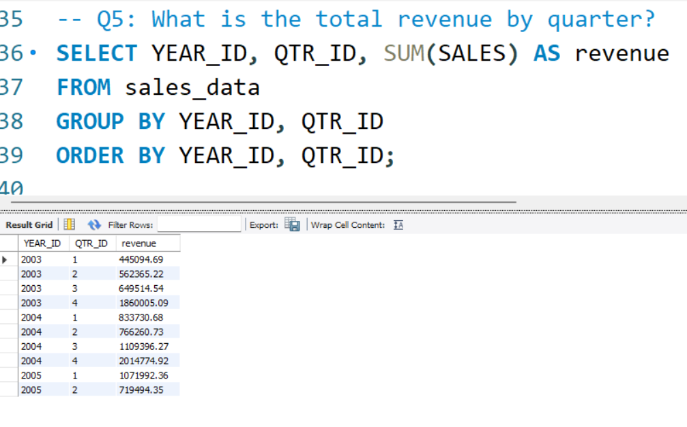  

- ❓ What are total sales by month?  
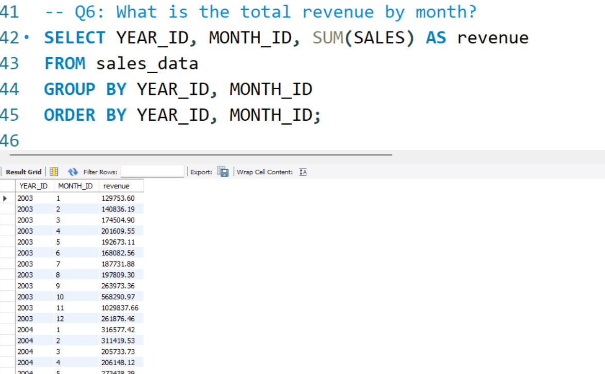  

---

### 3. Customer Analysis
- ❓ Who are the top 10 customers by revenue?  
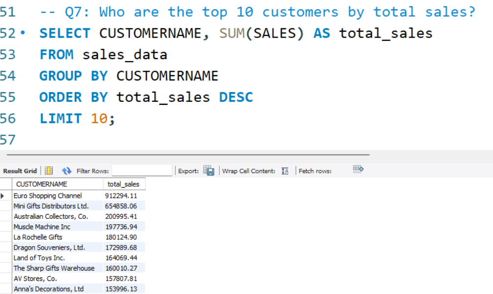  

- ❓ Which customer placed the most orders?  
  

---

### 4. Product Analysis
- ❓ What are total sales by product line?  
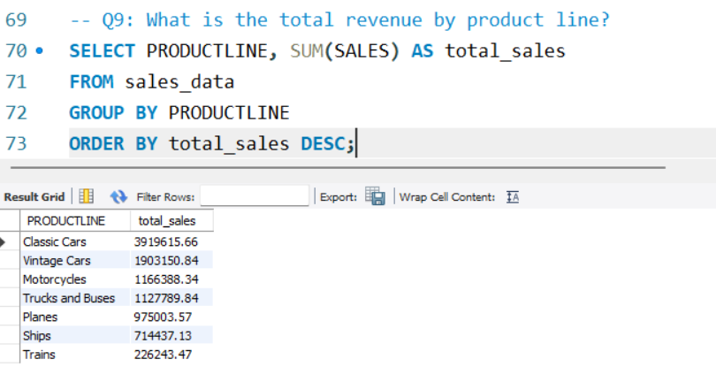  

- ❓ Which are the top 10 products by revenue?  
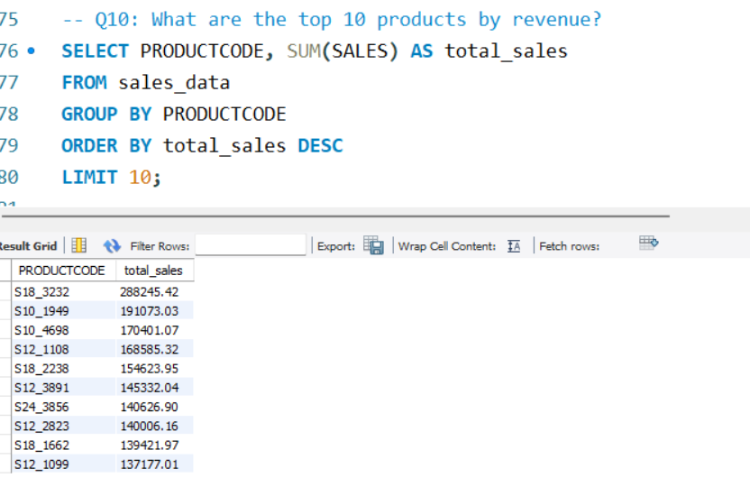  

---

### 5. Regional Analysis
- ❓ What are sales by country?  
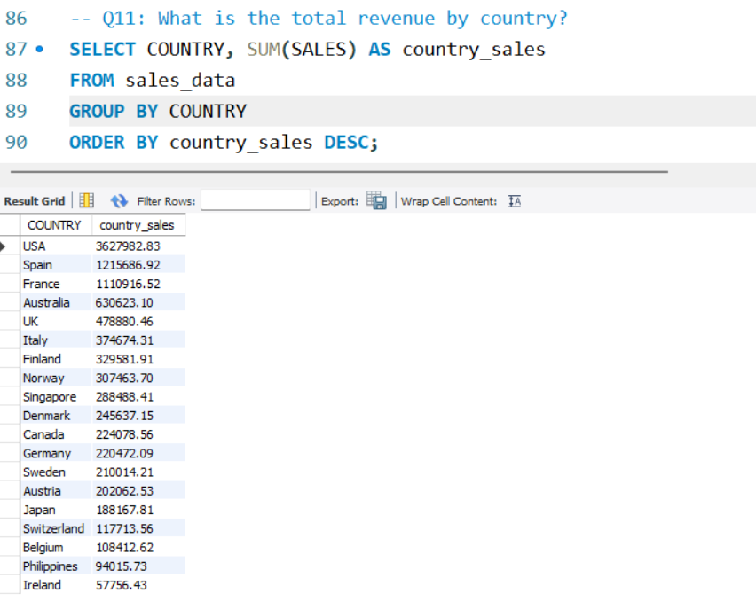  

- ❓ What are sales by territory?  
  

---

### 6. Deal Size Analysis
- ❓ How do sales vary by deal size?  
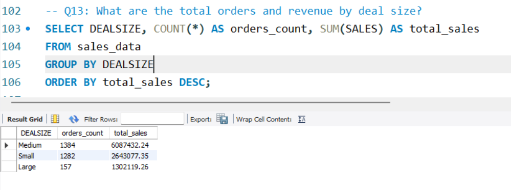  

---

### 7. Advanced Insights
- ❓ What is the average order value?  
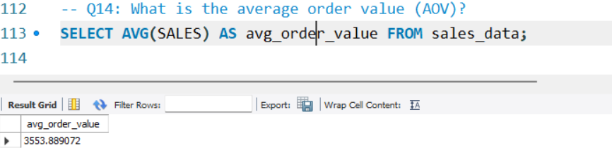  

- ❓ Which order had the highest sales?  
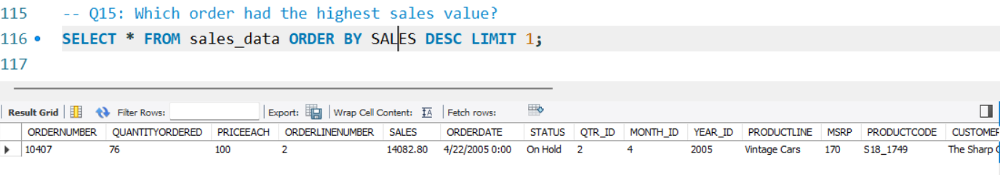  

- ❓ Which order had the lowest sales?  
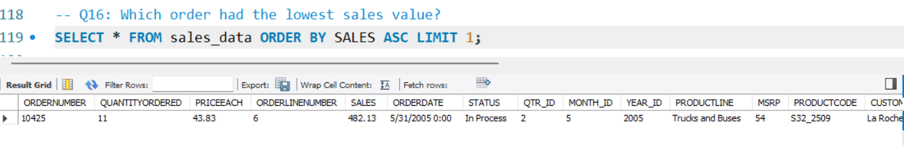  

- ❓ What is the year-over-year growth percentage?  
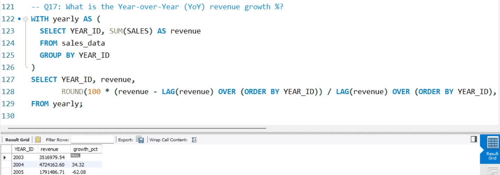  

---

## Key Insights
- 📈 **2004 had peak sales performance**  
- 🏆 **Classic Cars generated the most revenue**  
- 🌍 **USA led sales, followed by Europe**  
- 🤝 **Medium deal size contributed the most orders**  
- 👥 **Top customers made a big share of total revenue**  

---

## How to Run
1. Clone the repo:
   ```bash
   git clone https://github.com/YOURUSERNAME/ecommerce_sales_sql_analysis.git
Open MySQL Workbench.

Run scripts in order:

01_create_table.sql

02_load_data.sql

03_sanity_checks.sql

04_final_analysis.sql

Compare results with screenshots.

Tools Used
SQL (MySQL 8.0)

MySQL Workbench

GitHub

---

Author

Sayed Wahid 

📧swahid1656@gmail.com 

🔗 www.linkedin.com/in/sayedwahid


